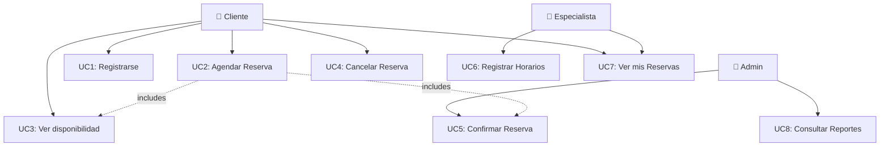
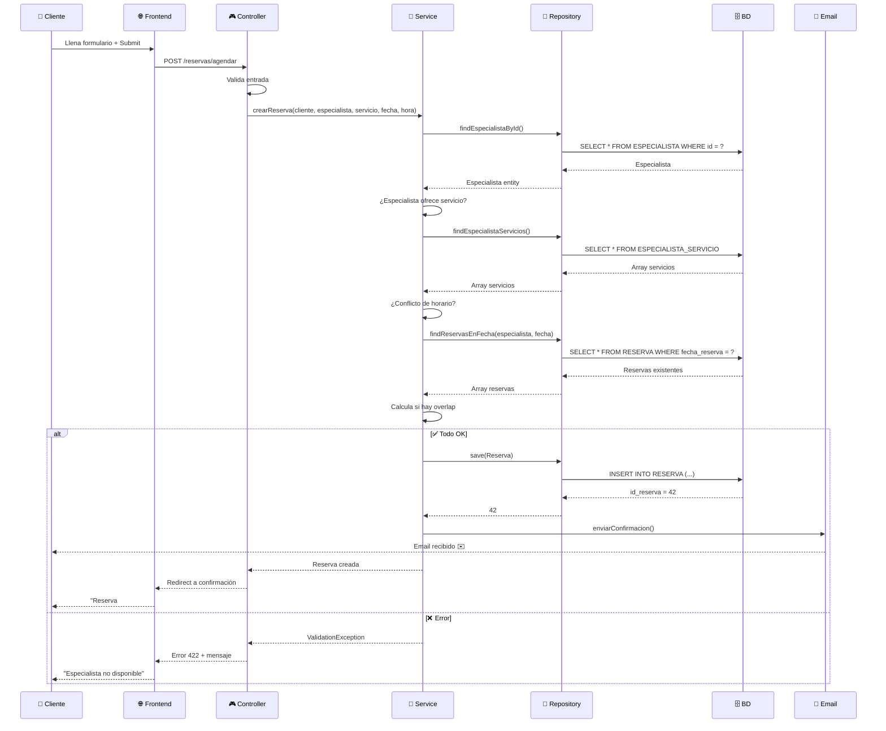
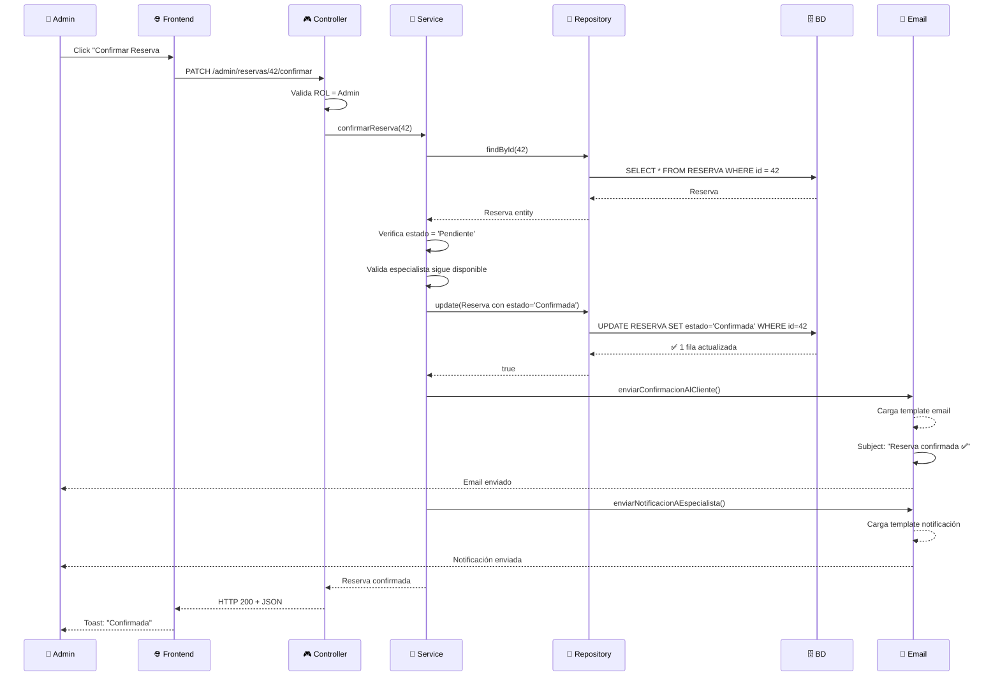
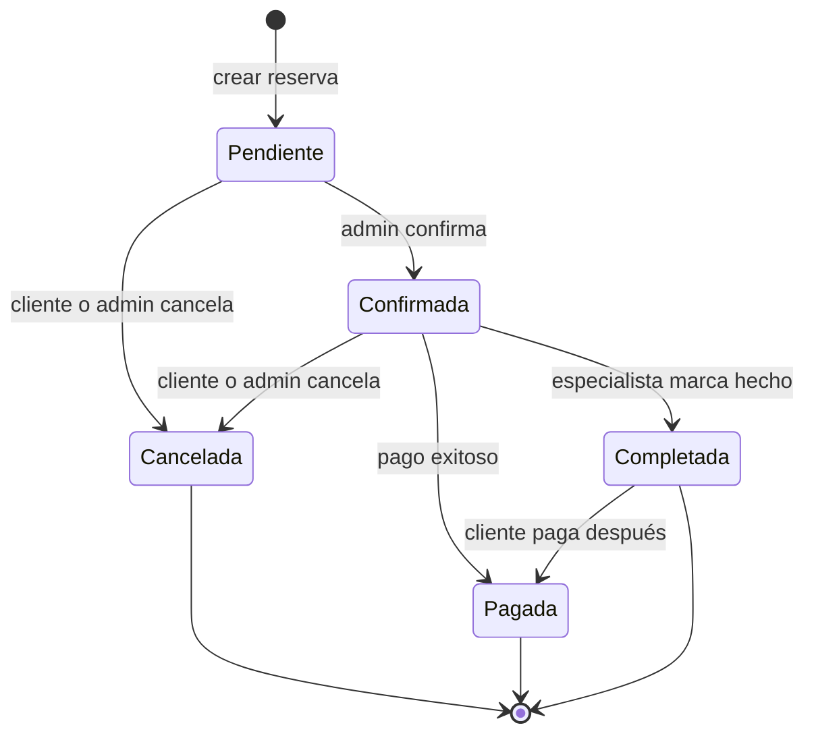

# Casos de Uso

## Diagrama de Casos de Uso



## Flujos Principales

### Flujo 1: Agendar Reserva (El corazón del sistema)

**Actores:** Cliente, Sistema, Especialista (notificación)

```
1. Cliente accede a /reservas/agendar
2. Sistema carga:
   - Servicios disponibles (SERVICIO.activo = 1)
   - Especialistas activos
3. Cliente selecciona:
   - Servicio (Ej: "Corte de Pelo")
   - Especialista (Ej: "María")
   - Fecha deseada (Ej: 2026-02-15)
4. Sistema calcula disponibilidad:
   - ¿Está el especialista disponible ese día?
     → Consulta HORARIO_ESPECIALISTA (dia_semana)
   - ¿El especialista ofrece ese servicio?
     → Consulta ESPECIALISTA_SERVICIO
   - ¿Hay espacio en el horario?
     → Calcula: duración_servicio + otras reservas
5. Sistema muestra slots libres (Ej: 09:00-09:30, 10:00-10:30)
6. Cliente elige slot y envía formulario
7. Sistema valida:
   - Email único si es nuevo cliente
   - Horario sigue siendo válido (race condition check)
   - Datos completos
8. Sistema crea RESERVA con estado = 'Pendiente'
9. Sistema envía email al cliente:
   - "Reserva confirmada para el 15-02-2026 a las 09:00"
   - Enlace para confirmar (requiere re-confirmación)
10. ✅ Reserva creada
```

**Excepciones:**
- Servicio inactivo → Error "Servicio no disponible"
- Especialista inactivo → No aparece en lista
- Slot ocupado (otro cliente reservó antes) → Recalcular slots
- Especialista no ofrece ese servicio → Error "Especialista no ofrece este servicio"

---

### Flujo 2: Confirmar Reserva (Admin autoriza)

**Actores:** Admin, Sistema, Cliente

```
1. Admin accede a panel /admin/reservas
2. Sistema muestra lista de reservas con estado 'Pendiente'
3. Admin revisa detalles:
   - Cliente: Laura Robles
   - Especialista: María (Experta en color)
   - Servicio: Tinte y Color (90 min)
   - Horario: 2026-02-15 09:00-10:30
   - Precio: €45.00
4. Admin verifica no hay overbooking
5. Admin hace click "Confirmar"
6. Sistema actualiza RESERVA.estado = 'Confirmada'
7. Sistema envía email al cliente:
   - "Tu reserva ha sido confirmada ✅"
8. Sistema envía notificación a especialista:
   - "Tienes una reserva confirmada mañana a las 09:00"
9. ✅ Reserva confirmada
```

**Notas:**
- Solo Admin puede confirmar (valida ROL en Middleware)
- Si el Admin rechaza → estado = 'Cancelada' + email al cliente

---

## Diagrama de Secuencia: Agendar Reserva



---

## Diagrama de Secuencia: Confirmar Reserva



---

## Estados de Reserva (State Machine)



**Transiciones permitidas:**
- Pendiente → Confirmada ✅
- Pendiente → Cancelada ✅
- Confirmada → Cancelada ✅ (si es más de 24h antes)
- Confirmada → Completada ✅
- Completada → Pagada ✅

---

## Casos de Uso Adicionales

### UC3: Ver Disponibilidad
**Actor:** Cliente

```
1. Cliente elige servicio + especialista + fecha
2. Sistema calcula slots disponibles:
   - Carga horario semanal del especialista
   - Calcula duración del servicio
   - Excluye slots con reservas existentes
   - Devuelve array: [09:00-09:30, 09:30-10:00, 10:00-10:30]
3. Cliente elige uno
4. ✅
```

### UC4: Cancelar Reserva
**Actor:** Cliente o Admin

```
1. Cliente elige reserva activa
2. Sistema verifica:
   - Estado actual (no cancelada ya)
   - Tiempo restante (ej: >24h para cancela gratis)
3. Sistema actualiza RESERVA.estado = 'Cancelada'
4. Sistema envía confirmación de cancelación
5. ✅
```

### UC6: Registrar Horarios
**Actor:** Especialista

```
1. Especialista accede a /mi-perfil/horarios
2. Carga horarios actuales (HORARIO_ESPECIALISTA)
3. Edita:
   - Lunes: 09:00-15:00
   - Martes: 09:00-14:00, 16:00-20:00
   - Miércoles: OFF
   - Etc.
4. Sistema valida:
   - No hay solapamientos
   - hora_fin > hora_inicio
5. Sistema actualiza HORARIO_ESPECIALISTA
6. ✅
```

---

## Reglas de Negocio Implementadas

| Regla | Dónde se valida |
|-------|-----------------|
| Un cliente no puede reservar en el pasado | ReservaService |
| Un especialista no puede estar overbooking | ReservaService (calcula overlaps) |
| Un especialista solo ofrece servicios específicos | ReservaService (JOIN ESPECIALISTA_SERVICIO) |
| Email es único | BD (UNIQUE constraint) + AuthService |
| Solo Admin puede confirmar reservas | AuthMiddleware + requerimiento ACL |
| Cancelación con menos de 24h tiene penalidad | ReservaService (lógica custom) |
| Password debe ser hasheado | AuthService (Bcrypt) |
| Sesión expira en 24h | SessionMiddleware |
