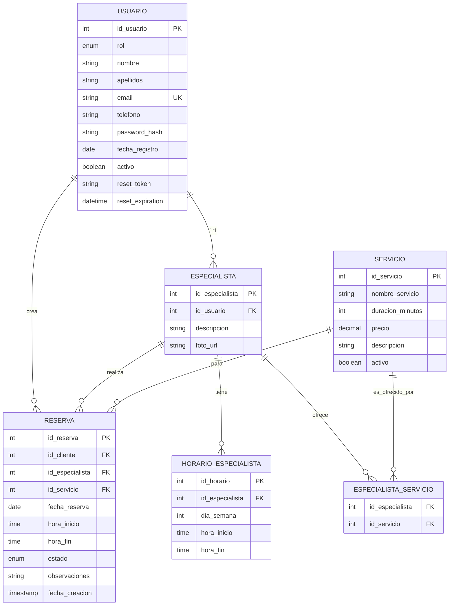

# Modelo de Datos

## Diagrama ER



## Tablas y Columnas

### USUARIO
Gestiona todos los usuarios del sistema (Admins, Especialistas, Clientes).

| Campo | Tipo | Constraints | Descripción |
|-------|------|-----------|-------------|
| `id_usuario` | INT | PK, AUTO_INCREMENT | Identificador único |
| `rol` | ENUM('Admin', 'Especialista', 'Cliente') | NOT NULL | Define permisos |
| `nombre` | VARCHAR(100) | NOT NULL | Nombre del usuario |
| `apellidos` | VARCHAR(100) | NOT NULL | Apellidos |
| `email` | VARCHAR(150) | NOT NULL, UNIQUE | Email único para login |
| `telefono` | VARCHAR(20) | NULL | Contacto opcional |
| `password_hash` | VARCHAR(255) | NOT NULL | Hash Bcrypt |
| `fecha_registro` | DATE | NOT NULL | Auditoría |
| `activo` | TINYINT(1) | DEFAULT 1 | Soft delete |
| `reset_token` | VARCHAR(64) | NULL | Token de reset de password |
| `reset_expiration` | DATETIME | NULL | Expiración del token |

**Índices:**
- PK: `id_usuario`
- UNIQUE: `email`

---

### ESPECIALISTA
Perfil específico para especialistas. Vinculado 1:1 a USUARIO.

| Campo | Tipo | Constraints | Descripción |
|-------|------|-----------|-------------|
| `id_especialista` | INT | PK, AUTO_INCREMENT | Identificador único |
| `id_usuario` | INT | FK → USUARIO, NOT NULL | Referencia al usuario (CASCADE DELETE) |
| `descripcion` | VARCHAR(255) | NULL | Bio / especialidades |
| `foto_url` | VARCHAR(255) | NULL | URL a ImageKit |

**Índices:**
- PK: `id_especialista`
- FK: `id_usuario`

---

### ESPECIALISTA_SERVICIO
Tabla de unión: qué servicios ofrece cada especialista (N:M).

| Campo | Tipo | Constraints | Descripción |
|-------|------|-----------|-------------|
| `id_especialista` | INT | FK → ESPECIALISTA, PK parte 1 | CASCADE DELETE |
| `id_servicio` | INT | FK → SERVICIO, PK parte 2 | CASCADE DELETE |

**Índices:**
- PK compuesta: (`id_especialista`, `id_servicio`)
- FK: `id_servicio`

---

### HORARIO_ESPECIALISTA
Disponibilidad semanal de cada especialista.

| Campo | Tipo | Constraints | Descripción |
|-------|------|-----------|-------------|
| `id_horario` | INT | PK, AUTO_INCREMENT | Identificador único |
| `id_especialista` | INT | FK → ESPECIALISTA, NOT NULL | CASCADE DELETE |
| `dia_semana` | INT | NOT NULL | 1=Lunes, 2=Martes, ..., 7=Domingo |
| `hora_inicio` | TIME | NOT NULL | Ej: 09:00:00 |
| `hora_fin` | TIME | NOT NULL | Ej: 15:00:00 |

**Índices:**
- PK: `id_horario`
- FK: `id_especialista`

**Nota:** El sistema NO valida que hora_fin > hora_inicio a nivel BD. Responsabilidad de Services.

---

### SERVICIO
Catálogo de servicios disponibles.

| Campo | Tipo | Constraints | Descripción |
|-------|------|-----------|-------------|
| `id_servicio` | INT | PK, AUTO_INCREMENT | Identificador único |
| `nombre_servicio` | VARCHAR(100) | NOT NULL | Ej: "Corte de Pelo" |
| `duracion_minutos` | INT | NOT NULL | Tiempo estimado en minutos |
| `precio` | DECIMAL(10,2) | NOT NULL | Precio en euros |
| `descripcion` | VARCHAR(255) | NULL | Detalles del servicio |
| `activo` | TINYINT(1) | DEFAULT 1 | Permite desactivar sin borrar |

**Índices:**
- PK: `id_servicio`

---

### RESERVA
Core del negocio: cada reserva vincula cliente + especialista + servicio + horario.

| Campo | Tipo | Constraints | Descripción |
|-------|------|-----------|-------------|
| `id_reserva` | INT | PK, AUTO_INCREMENT | Identificador único |
| `id_cliente` | INT | FK → USUARIO, NOT NULL | El usuario que reserva (CASCADE DELETE) |
| `id_especialista` | INT | FK → ESPECIALISTA, NOT NULL | Quién atiende (CASCADE DELETE) |
| `id_servicio` | INT | FK → SERVICIO, NOT NULL | Qué servicio (CASCADE DELETE) |
| `fecha_reserva` | DATE | NOT NULL | Día de la cita |
| `hora_inicio` | TIME | NOT NULL | Inicio exacto (Ej: 09:00) |
| `hora_fin` | TIME | NOT NULL | Fin estimado (Ej: 09:30) |
| `estado` | VARCHAR(50) | DEFAULT 'Pendiente' | Estados: Pendiente, Confirmada, Cancelada, Completada, Pagada |
| `observaciones` | VARCHAR(500) | NULL | Notas del cliente |
| `fecha_creacion` | TIMESTAMP | DEFAULT CURRENT_TIMESTAMP | Auditoría |

**Índices:**
- PK: `id_reserva`
- FK: `id_cliente`, `id_especialista`, `id_servicio`

**Restricciones de negocio validadas en Application/Services:**
- `fecha_reserva` >= TODAY (no reservas en pasado)
- `hora_fin` > `hora_inicio`
- El especialista debe estar disponible (`HORARIO_ESPECIALISTA`)
- No overlap de reservas del mismo especialista
- El especialista debe ofrecer ese servicio (`ESPECIALISTA_SERVICIO`)

---

## Constraints y Integridad

### Foreign Keys (Con CASCADE DELETE)
```sql
-- ESPECIALISTA → USUARIO
ALTER TABLE ESPECIALISTA
ADD CONSTRAINT ESPECIALISTA_ibfk_1
FOREIGN KEY (id_usuario) REFERENCES USUARIO(id_usuario) ON DELETE CASCADE;

-- RESERVA → USUARIO (cliente)
ALTER TABLE RESERVA
ADD CONSTRAINT RESERVA_ibfk_1
FOREIGN KEY (id_cliente) REFERENCES USUARIO(id_usuario) ON DELETE CASCADE;

-- Etc...
```

**Efecto:** Si se borra un usuario especialista, se borran automáticamente sus horarios y reservas asociadas.

### Unique Constraints
```sql
UNIQUE KEY email (email)  -- Garantiza login único
```

### Tipos de Datos

| Tipo | Razón |
|------|-------|
| `ENUM` | Limita valores posibles (rol, estado) a nivel BD |
| `DECIMAL(10,2)` | Precisión exacta para dinero (no FLOAT) |
| `VARCHAR(255) UTF8MB4` | Soporte completo a caracteres acentuados |
| `DATE` | Fechas sin hora |
| `TIME` | Horarios sin fecha |
| `TIMESTAMP ... CURRENT_TIMESTAMP` | Auditoría automática |

---

## Scenarios de Consultas Reales

### 1. Mostrar especialistas disponibles para un servicio en una fecha

```sql
SELECT DISTINCT e.*
FROM ESPECIALISTA e
JOIN ESPECIALISTA_SERVICIO es ON e.id_especialista = es.id_especialista
JOIN HORARIO_ESPECIALISTA he ON e.id_especialista = he.id_especialista
WHERE es.id_servicio = ?
  AND he.dia_semana = DAYOFWEEK(?) - 1  -- Mapear fecha a día semana
  AND e.id_usuario IN (SELECT id_usuario FROM USUARIO WHERE activo = 1)
ORDER BY e.id_especialista;
```

### 2. Verificar conflictos de horario (overbooking)

```sql
SELECT COUNT(*) as conflictos
FROM RESERVA r
WHERE r.id_especialista = ?
  AND r.fecha_reserva = ?
  AND r.estado NOT IN ('Cancelada')
  AND (
    (hora_inicio < ? AND hora_fin > ?)  -- Superpone
  );
```

### 3. Reporte de facturación por especialista

```sql
SELECT 
  e.id_especialista,
  u.nombre,
  COUNT(r.id_reserva) as total_reservas,
  SUM(s.precio) as ingresos_totales
FROM RESERVA r
JOIN ESPECIALISTA e ON r.id_especialista = e.id_especialista
JOIN USUARIO u ON e.id_usuario = u.id_usuario
JOIN SERVICIO s ON r.id_servicio = s.id_servicio
WHERE r.estado IN ('Completada', 'Pagada')
  AND r.fecha_reserva BETWEEN ? AND ?
GROUP BY e.id_especialista
ORDER BY ingresos_totales DESC;
```

---

## Evolución Futura

**Si creemos el producto:**
- Tabla `PAGO`: Detalles de transacciones Stripe
- Tabla `RESENA`: Calificaciones de clientes
- Tabla `NOTIFICACION`: Log de emails/SMS enviados
- Tabla `PROMOCION`: Códigos descuento
- Índices adicionales en `RESERVA(fecha_reserva)` cuando tengamos millones de filas
